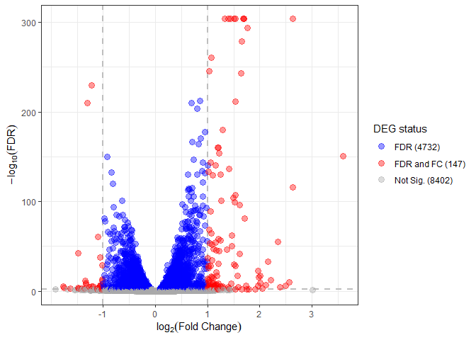

DESeq2
================
Marco Tello
2025-05-01

# Differential expression analysis

This report is to identify differentially expressed genes across the
following conditions:

1.  low glucose control (LG)
2.  high glucose control (HG)
3.  high glucose high fat control (HF)
4.  high glucose high fat PTS (PTS)
5.  high glucose high fat QUE (QUE)

## Format condition names

The first step is to load the selected expression data and format the
condition names to match the experimental conditions.

``` r
# Read exp table
input_file <- file.path(data_path, "protein_coding_exp_filtered-S10-R6.tsv")
exp_df <- read.table(input_file, header = TRUE)

# Convert data.table to integer matrix
exp_matrix <- exp_df %>%
  dplyr::select(!gene_id) %>%
  as.matrix()
rownames(exp_matrix) <- exp_df$gene_id

# Capture metadata in data frame
condition <- colnames(exp_matrix) %>% 
  str_replace(pattern = "\\d_S\\d+", 
              replacement = "")

# Format condition to match labels
condition <- case_when(
    condition == "C" ~ "HG",
    condition == "F" ~ "HF",
    condition == "L" ~ "LG",
    condition == "P" ~ "PTS",
    condition == "Q" ~ "QUE")
# Create variables for DE analysis
annot <- data.frame(condition = factor(condition, levels = c("LG", "HG", "HF", "PTS", "QUE")),
                    Hglucose  = ifelse(condition == "LG", 0, 1),
                    Hfat      = ifelse(condition %in% c("LG", "HG"), 0, 1),
                    PTS       = ifelse(condition == "PTS", 1, 0),
                    QUE       = ifelse(condition == "QUE", 1, 0),
                    row.names = colnames(exp_matrix))

annot 
```

    ##        condition Hglucose Hfat PTS QUE
    ## C1_S44        HG        1    0   0   0
    ## C2_S45        HG        1    0   0   0
    ## C3_S46        HG        1    0   0   0
    ## F1_S47        HF        1    1   0   0
    ## F2_S48        HF        1    1   0   0
    ## F3_S49        HF        1    1   0   0
    ## F4_S50        HF        1    1   0   0
    ## L1_S57        LG        0    0   0   0
    ## L2_S58        LG        0    0   0   0
    ## L3_S59        LG        0    0   0   0
    ## P1_S54       PTS        1    1   1   0
    ## P2_S2        PTS        1    1   1   0
    ## P2_S55       PTS        1    1   1   0
    ## P3_S56       PTS        1    1   1   0
    ## Q1_S51       QUE        1    1   0   1
    ## Q2_S52       QUE        1    1   0   1
    ## Q3_S1        QUE        1    1   0   1
    ## Q3_S53       QUE        1    1   0   1

Based on the experimental groups we created the appropriate labels and
encoded conditions as binary columns to facilitate building models.

## Set-up DEA parameters

For consistency, we’ll define the parameters for differential expression
here:

``` r
alpha <- 0.05
log2FC <- 2
```

The comparisons we’ll be looking into are the following:

1.  LG vs HG - to see how increasing glucose levels affects gene
    expression without fat
2.  HG vs HF - to isolate the impact of the high fat component under
    hyperglycemic conditions
3.  HF vs PTS - whether PTS can reverse or alter HF-induced gene changes
4.  HF vs QUE - whether QUE can reverse or alter HF-induced gene changes
5.  PTS vs QUE - to identify differences in molecular responses between
    the two compounds.
6.  LG vs PTS - to assess whether PTS brings HF-exposed cells back
    toward the low-glucose baseline
7.  LG vs QUE - to assess whether QUE brings HF-exposed cells back
    toward the low-glucose baseline

Thus, we’ll create a section for each of the target comparisons
containing:

- Model fitting and result selection
- p-value histograms
- volcano plot
- Output of DEGs

\##1. LG vs HG

how increasing glucose levels affects gene expression without fat?

``` r
# Re-define base condition
annot$condition <- relevel(annot$condition, ref = "LG")
# Make DESeq object
dds <- DESeqDataSetFromMatrix(countData = exp_matrix,
                              colData = annot,
                              design= ~ condition)

# Run DESeq2
dds <- DESeq(dds)
```

    ## estimating size factors

    ## estimating dispersions

    ## gene-wise dispersion estimates

    ## mean-dispersion relationship

    ## final dispersion estimates

    ## fitting model and testing

``` r
# Print comparisons made
resultsNames(dds)
```

    ## [1] "Intercept"           "condition_HG_vs_LG"  "condition_HF_vs_LG" 
    ## [4] "condition_PTS_vs_LG" "condition_QUE_vs_LG"

``` r
de_res <- results(dds,
                  name="condition_HG_vs_LG",
                  pAdjustMethod = "BH", 
                  alpha = alpha) 
summary(de_res)
```

    ## 
    ## out of 13360 with nonzero total read count
    ## adjusted p-value < 0.05
    ## LFC > 0 (up)       : 4297, 32%
    ## LFC < 0 (down)     : 4214, 32%
    ## outliers [1]       : 0, 0%
    ## low counts [2]     : 0, 0%
    ## (mean count < 4)
    ## [1] see 'cooksCutoff' argument of ?results
    ## [2] see 'independentFiltering' argument of ?results

``` r
temp <- as.data.table(de_res)
temp <- data.table(geneID = row.names(de_res), temp)
head(temp[padj <= alpha, ])
```

    ##             geneID   baseMean log2FoldChange      lfcSE       stat       pvalue
    ##             <char>      <num>          <num>      <num>      <num>        <num>
    ## 1: ENSG00000149527   48.48974     -2.1048559 0.22388308  -9.401585 5.374700e-21
    ## 2: ENSG00000171621  628.38465     -1.1592318 0.06449244 -17.974694 3.075542e-72
    ## 3: ENSG00000173614  192.69310     -0.4093901 0.11658397  -3.511547 4.455072e-04
    ## 4: ENSG00000171729  459.27124      0.4866868 0.07763367   6.269017 3.633348e-10
    ## 5: ENSG00000157916 1434.28566     -0.2061128 0.04953713  -4.160774 3.171706e-05
    ## 6: ENSG00000157881  397.83720     -0.3366340 0.08041387  -4.186268 2.835782e-05
    ##            padj
    ##           <num>
    ## 1: 3.051678e-20
    ## 2: 5.844843e-71
    ## 3: 9.249380e-04
    ## 4: 1.234839e-09
    ## 5: 7.437948e-05
    ## 6: 6.678309e-05

``` r
temp <- visualize_degs(as.data.table(de_res), alpha, log2FC)
temp
```

    ## [[1]]

<!-- -->

    ## 
    ## [[2]]

<!-- -->

\##2. HG vs HF

``` r
# Re-define base condition
annot$condition <- relevel(annot$condition, ref = "HG")
# Make DESeq object
dds <- DESeqDataSetFromMatrix(countData = exp_matrix,
                              colData = annot,
                              design= ~ condition)

# Run DESeq2
dds <- DESeq(dds)
```

    ## estimating size factors

    ## estimating dispersions

    ## gene-wise dispersion estimates

    ## mean-dispersion relationship

    ## final dispersion estimates

    ## fitting model and testing

``` r
# Print comparisons made
resultsNames(dds)
```

    ## [1] "Intercept"           "condition_LG_vs_HG"  "condition_HF_vs_HG" 
    ## [4] "condition_PTS_vs_HG" "condition_QUE_vs_HG"

``` r
de_res <- results(dds,
                  name="condition_HF_vs_HG",
                  pAdjustMethod = "BH", 
                  alpha = alpha) 
summary(de_res)
```

    ## 
    ## out of 13360 with nonzero total read count
    ## adjusted p-value < 0.05
    ## LFC > 0 (up)       : 3022, 23%
    ## LFC < 0 (down)     : 2962, 22%
    ## outliers [1]       : 0, 0%
    ## low counts [2]     : 260, 1.9%
    ## (mean count < 8)
    ## [1] see 'cooksCutoff' argument of ?results
    ## [2] see 'independentFiltering' argument of ?results

``` r
temp <- as.data.table(de_res)
temp <- data.table(geneID = row.names(de_res), temp)
head(temp[padj <= alpha, ])
```

    ##             geneID  baseMean log2FoldChange      lfcSE      stat       pvalue
    ##             <char>     <num>          <num>      <num>     <num>        <num>
    ## 1: ENSG00000171621  628.3846     -0.1684339 0.06549615 -2.571661 1.012120e-02
    ## 2: ENSG00000171729  459.2712     -0.5880293 0.07251402 -8.109181 5.096221e-16
    ## 3: ENSG00000048707 2231.9341      0.1106516 0.04252832  2.601834 9.272668e-03
    ## 4: ENSG00000184677 1223.8657     -0.1506729 0.04904798 -3.071950 2.126656e-03
    ## 5: ENSG00000131697  715.4727      0.2374044 0.06034807  3.933919 8.357205e-05
    ## 6: ENSG00000090020 1020.5361     -0.3555123 0.05105869 -6.962817 3.335347e-12
    ##            padj
    ##           <num>
    ## 1: 2.449430e-02
    ## 2: 6.954219e-15
    ## 3: 2.262047e-02
    ## 4: 6.051086e-03
    ## 5: 3.165059e-04
    ## 6: 3.267992e-11

``` r
temp <- visualize_degs(as.data.table(de_res), alpha, log2FC)
temp
```

    ## [[1]]

<!-- -->

    ## 
    ## [[2]]

<!-- -->

\##3. HF vs PTS

``` r
# Re-define base condition
annot$condition <- relevel(annot$condition, ref = "HF")
# Make DESeq object
dds <- DESeqDataSetFromMatrix(countData = exp_matrix,
                              colData = annot,
                              design= ~ condition)

# Run DESeq2
dds <- DESeq(dds)
```

    ## estimating size factors

    ## estimating dispersions

    ## gene-wise dispersion estimates

    ## mean-dispersion relationship

    ## final dispersion estimates

    ## fitting model and testing

``` r
# Print comparisons made
resultsNames(dds)
```

    ## [1] "Intercept"           "condition_HG_vs_HF"  "condition_LG_vs_HF" 
    ## [4] "condition_PTS_vs_HF" "condition_QUE_vs_HF"

``` r
de_res <- results(dds,
                  name="condition_PTS_vs_HF",
                  pAdjustMethod = "BH", 
                  alpha = alpha) 
summary(de_res)
```

    ## 
    ## out of 13360 with nonzero total read count
    ## adjusted p-value < 0.05
    ## LFC > 0 (up)       : 3254, 24%
    ## LFC < 0 (down)     : 3345, 25%
    ## outliers [1]       : 0, 0%
    ## low counts [2]     : 0, 0%
    ## (mean count < 4)
    ## [1] see 'cooksCutoff' argument of ?results
    ## [2] see 'independentFiltering' argument of ?results

``` r
temp <- as.data.table(de_res)
temp <- data.table(geneID = row.names(de_res), temp)
head(temp[padj <= alpha, ])
```

    ##             geneID  baseMean log2FoldChange      lfcSE      stat       pvalue
    ##             <char>     <num>          <num>      <num>     <num>        <num>
    ## 1: ENSG00000171621  628.3846     0.48509528 0.06389601  7.591950 3.151266e-14
    ## 2: ENSG00000171729  459.2712     0.24965312 0.07366883  3.388857 7.018462e-04
    ## 3: ENSG00000048707 2231.9341    -0.09988894 0.04139600 -2.413009 1.582142e-02
    ## 4: ENSG00000184677 1223.8657     0.14439762 0.04833863  2.987210 2.815365e-03
    ## 5: ENSG00000131697  715.4727    -0.41458461 0.06086508 -6.811535 9.656297e-12
    ## 6: ENSG00000158006  334.5533     0.20256849 0.08250389  2.455260 1.407827e-02
    ##            padj
    ##           <num>
    ## 1: 3.000778e-13
    ## 2: 2.027387e-03
    ## 3: 3.364758e-02
    ## 4: 7.160343e-03
    ## 5: 7.633617e-11
    ## 6: 3.044608e-02

``` r
temp <- visualize_degs(as.data.table(de_res), alpha, log2FC)
temp
```

    ## [[1]]

<!-- -->

    ## 
    ## [[2]]

<!-- -->

\##4. HF vs QUE

``` r
# Re-define base condition
annot$condition <- relevel(annot$condition, ref = "HF")
# Make DESeq object
dds <- DESeqDataSetFromMatrix(countData = exp_matrix,
                              colData = annot,
                              design= ~ condition)

# Run DESeq2
dds <- DESeq(dds)
```

    ## estimating size factors

    ## estimating dispersions

    ## gene-wise dispersion estimates

    ## mean-dispersion relationship

    ## final dispersion estimates

    ## fitting model and testing

``` r
# Print comparisons made
resultsNames(dds)
```

    ## [1] "Intercept"           "condition_HG_vs_HF"  "condition_LG_vs_HF" 
    ## [4] "condition_PTS_vs_HF" "condition_QUE_vs_HF"

``` r
de_res <- results(dds,
                  name="condition_QUE_vs_HF",
                  pAdjustMethod = "BH", 
                  alpha = alpha) 
summary(de_res)
```

    ## 
    ## out of 13360 with nonzero total read count
    ## adjusted p-value < 0.05
    ## LFC > 0 (up)       : 3895, 29%
    ## LFC < 0 (down)     : 3951, 30%
    ## outliers [1]       : 0, 0%
    ## low counts [2]     : 0, 0%
    ## (mean count < 4)
    ## [1] see 'cooksCutoff' argument of ?results
    ## [2] see 'independentFiltering' argument of ?results

``` r
temp <- as.data.table(de_res)
temp <- data.table(geneID = row.names(de_res), temp)
head(temp[padj <= alpha, ])
```

    ##             geneID  baseMean log2FoldChange      lfcSE      stat       pvalue
    ##             <char>     <num>          <num>      <num>     <num>        <num>
    ## 1: ENSG00000142655  707.0233     -0.2501439 0.05899569 -4.240037 2.234831e-05
    ## 2: ENSG00000171621  628.3846      0.5843867 0.06257828  9.338491 9.771718e-21
    ## 3: ENSG00000173614  192.6931      0.4840473 0.10950277  4.420412 9.851311e-06
    ## 4: ENSG00000157881  397.8372     -0.2604084 0.07720919 -3.372765 7.441749e-04
    ## 5: ENSG00000184677 1223.8657      0.2073118 0.04766065  4.349748 1.362939e-05
    ## 6: ENSG00000090020 1020.5361      0.1477222 0.05081270  2.907190 3.646913e-03
    ##            padj
    ##           <num>
    ## 1: 6.461230e-05
    ## 2: 9.501467e-20
    ## 3: 2.988499e-05
    ## 4: 1.726372e-03
    ## 5: 4.053621e-05
    ## 6: 7.514305e-03

``` r
temp <- visualize_degs(as.data.table(de_res), alpha, log2FC)
temp
```

    ## [[1]]

<!-- -->

    ## 
    ## [[2]]

<!-- -->

\##5. PTS vs QUE

``` r
# Re-define base condition
annot$condition <- relevel(annot$condition, ref = "PTS")
# Make DESeq object
dds <- DESeqDataSetFromMatrix(countData = exp_matrix,
                              colData = annot,
                              design= ~ condition)

# Run DESeq2
dds <- DESeq(dds)
```

    ## estimating size factors

    ## estimating dispersions

    ## gene-wise dispersion estimates

    ## mean-dispersion relationship

    ## final dispersion estimates

    ## fitting model and testing

``` r
# Print comparisons made
resultsNames(dds)
```

    ## [1] "Intercept"            "condition_HF_vs_PTS"  "condition_HG_vs_PTS" 
    ## [4] "condition_LG_vs_PTS"  "condition_QUE_vs_PTS"

``` r
de_res <- results(dds,
                  name="condition_QUE_vs_PTS",
                  pAdjustMethod = "BH", 
                  alpha = alpha) 
summary(de_res)
```

    ## 
    ## out of 13360 with nonzero total read count
    ## adjusted p-value < 0.05
    ## LFC > 0 (up)       : 2745, 21%
    ## LFC < 0 (down)     : 3440, 26%
    ## outliers [1]       : 0, 0%
    ## low counts [2]     : 0, 0%
    ## (mean count < 4)
    ## [1] see 'cooksCutoff' argument of ?results
    ## [2] see 'independentFiltering' argument of ?results

``` r
temp <- as.data.table(de_res)
temp <- data.table(geneID = row.names(de_res), temp)
head(temp[padj <= alpha, ])
```

    ##             geneID  baseMean log2FoldChange      lfcSE      stat       pvalue
    ##             <char>     <num>          <num>      <num>     <num>        <num>
    ## 1: ENSG00000142655  707.0233     -0.2489628 0.06228902 -3.996897 6.417829e-05
    ## 2: ENSG00000173614  192.6931      0.5076127 0.11748267  4.320746 1.555028e-05
    ## 3: ENSG00000157916 1434.2857     -0.1515979 0.04768735 -3.178997 1.477858e-03
    ## 4: ENSG00000157881  397.8372     -0.3387885 0.08113813 -4.175454 2.973927e-05
    ## 5: ENSG00000048707 2231.9341      0.1674146 0.04259055  3.930791 8.466696e-05
    ## 6: ENSG00000180758  877.1689     -0.1555444 0.06069059 -2.562908 1.037995e-02
    ##            padj
    ##           <num>
    ## 1: 2.647999e-04
    ## 2: 7.246313e-05
    ## 3: 4.467010e-03
    ## 4: 1.311276e-04
    ## 5: 3.417373e-04
    ## 6: 2.501649e-02

``` r
temp <- visualize_degs(as.data.table(de_res), alpha, log2FC)
temp
```

    ## [[1]]

<!-- -->

    ## 
    ## [[2]]

<!-- -->

\##6. LG vs PTS

``` r
# Re-define base condition
annot$condition <- relevel(annot$condition, ref = "LG")
# Make DESeq object
dds <- DESeqDataSetFromMatrix(countData = exp_matrix,
                              colData = annot,
                              design= ~ condition)

# Run DESeq2
dds <- DESeq(dds)
```

    ## estimating size factors

    ## estimating dispersions

    ## gene-wise dispersion estimates

    ## mean-dispersion relationship

    ## final dispersion estimates

    ## fitting model and testing

``` r
# Print comparisons made
resultsNames(dds)
```

    ## [1] "Intercept"           "condition_PTS_vs_LG" "condition_HF_vs_LG" 
    ## [4] "condition_HG_vs_LG"  "condition_QUE_vs_LG"

``` r
de_res <- results(dds,
                  name="condition_PTS_vs_LG",
                  pAdjustMethod = "BH", 
                  alpha = alpha) 
summary(de_res)
```

    ## 
    ## out of 13360 with nonzero total read count
    ## adjusted p-value < 0.05
    ## LFC > 0 (up)       : 4227, 32%
    ## LFC < 0 (down)     : 4110, 31%
    ## outliers [1]       : 0, 0%
    ## low counts [2]     : 0, 0%
    ## (mean count < 4)
    ## [1] see 'cooksCutoff' argument of ?results
    ## [2] see 'independentFiltering' argument of ?results

``` r
temp <- as.data.table(de_res)
temp <- data.table(geneID = row.names(de_res), temp)
head(temp[padj <= alpha, ])
```

    ##             geneID   baseMean log2FoldChange      lfcSE       stat       pvalue
    ##             <char>      <num>          <num>      <num>      <num>        <num>
    ## 1: ENSG00000149527   48.48974     -1.9663281 0.22362595  -8.792933 1.457052e-18
    ## 2: ENSG00000171621  628.38465     -0.8425705 0.06286674 -13.402483 5.847359e-41
    ## 3: ENSG00000173614  192.69310     -0.6648451 0.11943293  -5.566681 2.596363e-08
    ## 4: ENSG00000157916 1434.28566     -0.1074045 0.04853875  -2.212758 2.691436e-02
    ## 5: ENSG00000157881  397.83720     -0.2142148 0.07959043  -2.691464 7.113920e-03
    ## 6: ENSG00000048707 2231.93411     -0.1133188 0.04445827  -2.548880 1.080695e-02
    ##            padj
    ##           <num>
    ## 1: 8.397851e-18
    ## 2: 7.012632e-40
    ## 3: 8.342331e-08
    ## 4: 4.363408e-02
    ## 5: 1.284164e-02
    ## 6: 1.885852e-02

``` r
temp <- visualize_degs(as.data.table(de_res), alpha, log2FC)
temp
```

    ## [[1]]

<!-- -->

    ## 
    ## [[2]]

<!-- -->

\##7. LG vs QUE

``` r
# Re-define base condition
annot$condition <- relevel(annot$condition, ref = "LG")
# Make DESeq object
dds <- DESeqDataSetFromMatrix(countData = exp_matrix,
                              colData = annot,
                              design= ~ condition)

# Run DESeq2
dds <- DESeq(dds)
```

    ## estimating size factors

    ## estimating dispersions

    ## gene-wise dispersion estimates

    ## mean-dispersion relationship

    ## final dispersion estimates

    ## fitting model and testing

``` r
# Print comparisons made
resultsNames(dds)
```

    ## [1] "Intercept"           "condition_PTS_vs_LG" "condition_HF_vs_LG" 
    ## [4] "condition_HG_vs_LG"  "condition_QUE_vs_LG"

``` r
de_res <- results(dds,
                  name="condition_QUE_vs_LG",
                  pAdjustMethod = "BH", 
                  alpha = alpha) 
summary(de_res)
```

    ## 
    ## out of 13360 with nonzero total read count
    ## adjusted p-value < 0.05
    ## LFC > 0 (up)       : 4363, 33%
    ## LFC < 0 (down)     : 4310, 32%
    ## outliers [1]       : 0, 0%
    ## low counts [2]     : 0, 0%
    ## (mean count < 4)
    ## [1] see 'cooksCutoff' argument of ?results
    ## [2] see 'independentFiltering' argument of ?results

``` r
temp <- as.data.table(de_res)
temp <- data.table(geneID = row.names(de_res), temp)
head(temp[padj <= alpha, ])
```

    ##             geneID   baseMean log2FoldChange      lfcSE       stat       pvalue
    ##             <char>      <num>          <num>      <num>      <num>        <num>
    ## 1: ENSG00000142655  707.02328     -0.3289798 0.06290972  -5.229395 1.700654e-07
    ## 2: ENSG00000149527   48.48974     -2.4418563 0.23399402 -10.435550 1.706231e-25
    ## 3: ENSG00000171621  628.38465     -0.7432791 0.06152698 -12.080538 1.338403e-33
    ## 4: ENSG00000157916 1434.28566     -0.2590024 0.04862942  -5.326044 1.003748e-07
    ## 5: ENSG00000157881  397.83720     -0.5530033 0.08109856  -6.818904 9.173754e-12
    ## 6: ENSG00000162444   13.27471      1.1644722 0.44472930   2.618384 8.834729e-03
    ##            padj
    ##           <num>
    ## 1: 4.811678e-07
    ## 2: 1.184784e-24
    ## 3: 1.184962e-32
    ## 4: 2.886992e-07
    ## 5: 3.463163e-11
    ## 6: 1.497298e-02

``` r
temp <- visualize_degs(as.data.table(de_res), alpha, log2FC)
temp
```

    ## [[1]]

<!-- -->

    ## 
    ## [[2]]

<!-- -->
