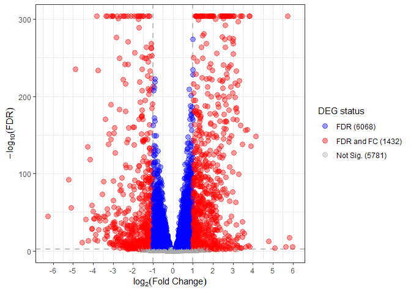
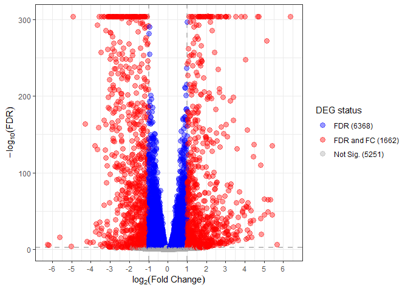
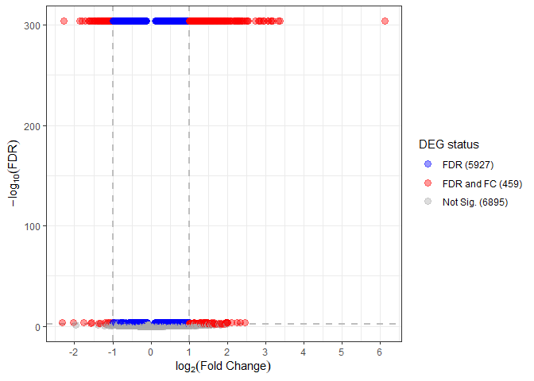

DESeq2
================
Marco Tello
2025-05-01

# Differential expression analysis

This report is to identify differentially expressed genes across the
following conditions:

1.  low glucose control (LG)
2.  high glucose control (HG)
3.  high glucose high fat control (HF)
4.  high glucose high fat PTS (PTS)
5.  high glucose high fat QUE (QUE)

## Format condition names

The first step is to load the selected expression data and format the
condition names to match the experimental conditions.

``` r
# Read exp table
input_file <- file.path(data_path, "protein_coding_exp_filtered-S10-R6.tsv")
exp_df <- fread(input = input_file, drop = c("P2_S2", "Q3_S1"))


# Connect to the Ensembl mart
ensembl <- useEnsembl("genes")
ensembl <- useDataset(dataset = "hsapiens_gene_ensembl", mart = ensembl)

# Query for gene symbol
bm <- getBM(
    attributes = c("ensembl_gene_id", "external_gene_name"),
    filters    = "ensembl_gene_id",
    values     = exp_df$gene_id,
    mart       = ensembl)
exp_df <- merge.data.table(x = as.data.table(bm), y = exp_df, 
                           by.x = "ensembl_gene_id", by.y = "gene_id", 
                           all.x = FALSE, all.y = TRUE)
exp_df <- data.table(exp_df)

# Remove genes with no gene symbol
exp_df <- exp_df[external_gene_name != ""]

# Only one gene symbol has two ENSEMBL IDs so we handle it separately
exp_df[external_gene_name == "POLR2J3", external_gene_name := paste(external_gene_name, 
                                                                    ensembl_gene_id, 
                                                                    sep = "_")]

# Convert data.table to integer matrix
exp_matrix <- exp_df %>%
  dplyr::select(!ensembl_gene_id) %>%
  dplyr::select(!external_gene_name) %>%
  as.matrix()
rownames(exp_matrix) <- exp_df$external_gene_name


# Capture metadata in data frame
condition <- colnames(exp_matrix) %>% 
  str_replace(pattern = "\\d_S\\d+", 
              replacement = "")

# Format condition to match labels
condition <- case_when(
    condition == "C" ~ "HG",
    condition == "F" ~ "HF",
    condition == "L" ~ "LG",
    condition == "P" ~ "PTS",
    condition == "Q" ~ "QUE")
# Create variables for DE analysis
annot <- data.frame(condition = factor(condition, levels = c("LG", "HG", "HF", "PTS", "QUE")),
                    Hglucose  = factor(ifelse(condition == "LG", 0, 1)),
                    Hfat      = factor(ifelse(condition %in% c("LG", "HG"), 0, 1)),
                    PTS       = factor(ifelse(condition == "PTS", 1, 0)),
                    QUE       = factor(ifelse(condition == "QUE", 1, 0)),
                    row.names = colnames(exp_matrix))

annot 
```

    ##        condition Hglucose Hfat PTS QUE
    ## C1_S44        HG        1    0   0   0
    ## C2_S45        HG        1    0   0   0
    ## C3_S46        HG        1    0   0   0
    ## F1_S47        HF        1    1   0   0
    ## F2_S48        HF        1    1   0   0
    ## F3_S49        HF        1    1   0   0
    ## F4_S50        HF        1    1   0   0
    ## L1_S57        LG        0    0   0   0
    ## L2_S58        LG        0    0   0   0
    ## L3_S59        LG        0    0   0   0
    ## P1_S54       PTS        1    1   1   0
    ## P2_S55       PTS        1    1   1   0
    ## P3_S56       PTS        1    1   1   0
    ## Q1_S51       QUE        1    1   0   1
    ## Q2_S52       QUE        1    1   0   1
    ## Q3_S53       QUE        1    1   0   1

Based on the experimental groups we created the appropriate labels and
encoded conditions as binary columns to facilitate building models.

## Set-up DEA parameters

For consistency, we’ll define the parameters for differential expression
here:

``` r
alpha <- 0.01
log2FC <- 1
```

The comparisons we’ll be looking into are the following:

1.  LG vs HG - to see how increasing glucose levels affects gene
    expression without fat
2.  HG vs HF - to isolate the impact of the high fat component under
    hyperglycemic conditions
3.  HF vs PTS - whether PTS can reverse or alter HF-induced gene changes
4.  HF vs QUE - whether QUE can reverse or alter HF-induced gene changes
5.  PTS vs QUE - to identify differences in molecular responses between
    the two compounds.
6.  LG vs PTS - to assess whether PTS brings HF-exposed cells back
    toward the low-glucose baseline
7.  LG vs QUE - to assess whether QUE brings HF-exposed cells back
    toward the low-glucose baseline

Thus, we’ll create a section for each of the target comparisons
containing:

- Model fitting and result selection
- p-value histograms
- volcano plot
- Output of DEGs

\##1. LG vs HG

how increasing glucose levels affects gene expression without fat?

``` r
# Re-define base condition
annot$condition <- relevel(annot$condition, ref = "LG")
# Make DESeq object
dds <- DESeqDataSetFromMatrix(countData = exp_matrix,
                              colData = annot,
                              design= ~ condition)

# Run DESeq2
dds <- DESeq(dds)
```

    ## estimating size factors

    ## estimating dispersions

    ## gene-wise dispersion estimates

    ## mean-dispersion relationship

    ## final dispersion estimates

    ## fitting model and testing

``` r
# Print comparisons made
resultsNames(dds)
```

    ## [1] "Intercept"           "condition_HG_vs_LG"  "condition_HF_vs_LG" 
    ## [4] "condition_PTS_vs_LG" "condition_QUE_vs_LG"

``` r
comparison <- "condition_HG_vs_LG"

de_res <- results(dds,
                  name=comparison,
                  pAdjustMethod = "BH") 
temp <- as.data.table(de_res)
de_res <- data.table(geneID = row.names(de_res), temp)


out_file <- file.path(out_path, paste("deseq2_", 
                                      str_replace_all(comparison, "_", ""),
                                      "_FDR", str_replace(alpha, "\\.", ""),
                                      ".tsv", sep = ""))
if(!file.exists(out_file)){
  output_table = de_res
  output_table[, log2FoldChange := round(log2FoldChange, 4)]
  output_table[, baseMean       := round(baseMean, 4)]
  output_table[, lfcSE          := round(lfcSE, 4)]
  output_table[, stat           := round(stat, 4)]
  output_table[, pvalue         := round(pvalue, 4)]
  output_table[, padj           := round(padj, 4)]
  output_table[, FoldChange := round((2**abs(log2FoldChange))*sign(log2FoldChange), 4)]
  fwrite(x = output_table, file = out_file, 
         append = FALSE, quote = FALSE, sep = '\t', 
         row.names = FALSE, col.names = TRUE)
}

temp <- visualize_degs(de_res, alpha, log2FC)
temp
```

    ## [[1]]

<!-- -->

    ## 
    ## [[2]]

<!-- -->

\##2. HG vs HF

``` r
# Re-define base condition
annot$condition <- relevel(annot$condition, ref = "HG")
# Make DESeq object
dds <- DESeqDataSetFromMatrix(countData = exp_matrix,
                              colData = annot,
                              design= ~ condition)

# Run DESeq2
dds <- DESeq(dds)
```

    ## estimating size factors

    ## estimating dispersions

    ## gene-wise dispersion estimates

    ## mean-dispersion relationship

    ## final dispersion estimates

    ## fitting model and testing

``` r
# Print comparisons made
resultsNames(dds)
```

    ## [1] "Intercept"           "condition_LG_vs_HG"  "condition_HF_vs_HG" 
    ## [4] "condition_PTS_vs_HG" "condition_QUE_vs_HG"

``` r
comparison <- "condition_HF_vs_HG"

de_res <- results(dds,
                  name=comparison,
                  pAdjustMethod = "BH") 
temp <- as.data.table(de_res)
de_res <- data.table(geneID = row.names(de_res), temp)


out_file <- file.path(out_path, paste("deseq2_", 
                                      str_replace_all(comparison, "_", ""),
                                      "_FDR", str_replace(alpha, "\\.", ""),
                                      ".tsv", sep = ""))
if(!file.exists(out_file)){
  output_table = de_res
  output_table[, log2FoldChange := round(log2FoldChange, 4)]
  output_table[, baseMean       := round(baseMean, 4)]
  output_table[, lfcSE          := round(lfcSE, 4)]
  output_table[, stat           := round(stat, 4)]
  output_table[, pvalue         := round(pvalue, 4)]
  output_table[, padj           := round(padj, 4)]
  output_table[, FoldChange := round((2**abs(log2FoldChange))*sign(log2FoldChange), 4)]
  fwrite(x = output_table, file = out_file, 
         append = FALSE, quote = FALSE, sep = '\t', 
         row.names = FALSE, col.names = TRUE)
}

temp <- visualize_degs(de_res, alpha, log2FC)
temp
```

    ## [[1]]

<!-- -->

    ## 
    ## [[2]]

<!-- -->

\##3. LG vs HF

how increasing glucose levels affects gene expression without fat?

``` r
# Re-define base condition
annot$condition <- relevel(annot$condition, ref = "LG")
# Make DESeq object
dds <- DESeqDataSetFromMatrix(countData = exp_matrix,
                              colData = annot,
                              design= ~ condition)

# Run DESeq2
dds <- DESeq(dds)
```

    ## estimating size factors

    ## estimating dispersions

    ## gene-wise dispersion estimates

    ## mean-dispersion relationship

    ## final dispersion estimates

    ## fitting model and testing

``` r
# Print comparisons made
resultsNames(dds)
```

    ## [1] "Intercept"           "condition_HG_vs_LG"  "condition_HF_vs_LG" 
    ## [4] "condition_PTS_vs_LG" "condition_QUE_vs_LG"

``` r
comparison <- "condition_HF_vs_LG"

de_res <- results(dds,
                  name=comparison,
                  pAdjustMethod = "BH") 
temp <- as.data.table(de_res)
de_res <- data.table(geneID = row.names(de_res), temp)


out_file <- file.path(out_path, paste("deseq2_", 
                                      str_replace_all(comparison, "_", ""),
                                      "_FDR", str_replace(alpha, "\\.", ""),
                                      ".tsv", sep = ""))
if(!file.exists(out_file)){
  output_table = de_res
  output_table[, log2FoldChange := round(log2FoldChange, 4)]
  output_table[, baseMean       := round(baseMean, 4)]
  output_table[, lfcSE          := round(lfcSE, 4)]
  output_table[, stat           := round(stat, 4)]
  output_table[, pvalue         := round(pvalue, 4)]
  output_table[, padj           := round(padj, 4)]
  output_table[, FoldChange := round((2**abs(log2FoldChange))*sign(log2FoldChange), 4)]
  fwrite(x = output_table, file = out_file, 
         append = FALSE, quote = FALSE, sep = '\t', 
         row.names = FALSE, col.names = TRUE)
}

temp <- visualize_degs(de_res, alpha, log2FC)
temp
```

    ## [[1]]

<!-- -->

    ## 
    ## [[2]]

<!-- -->

\##3. HF vs PTS

``` r
# Re-define base condition
annot$condition <- relevel(annot$condition, ref = "HF")
# Make DESeq object
dds <- DESeqDataSetFromMatrix(countData = exp_matrix,
                              colData = annot,
                              design= ~ condition)

# Run DESeq2
dds <- DESeq(dds)
```

    ## estimating size factors

    ## estimating dispersions

    ## gene-wise dispersion estimates

    ## mean-dispersion relationship

    ## final dispersion estimates

    ## fitting model and testing

``` r
# Print comparisons made
resultsNames(dds)
```

    ## [1] "Intercept"           "condition_LG_vs_HF"  "condition_HG_vs_HF" 
    ## [4] "condition_PTS_vs_HF" "condition_QUE_vs_HF"

``` r
comparison <- "condition_PTS_vs_HF"

de_res <- results(dds,
                  name=comparison,
                  pAdjustMethod = "BH") 
temp <- as.data.table(de_res)
de_res <- data.table(geneID = row.names(de_res), temp)


out_file <- file.path(out_path, paste("deseq2_", 
                                      str_replace_all(comparison, "_", ""),
                                      "_FDR", str_replace(alpha, "\\.", ""),
                                      ".tsv", sep = ""))
if(!file.exists(out_file)){
  output_table = de_res
  output_table[, log2FoldChange := round(log2FoldChange, 4)]
  output_table[, baseMean       := round(baseMean, 4)]
  output_table[, lfcSE          := round(lfcSE, 4)]
  output_table[, stat           := round(stat, 4)]
  output_table[, pvalue         := round(pvalue, 4)]
  output_table[, padj           := round(padj, 4)]
  output_table[, FoldChange := round((2**abs(log2FoldChange))*sign(log2FoldChange), 4)]
  fwrite(x = output_table, file = out_file, 
         append = FALSE, quote = FALSE, sep = '\t', 
         row.names = FALSE, col.names = TRUE)
}

temp <- visualize_degs(de_res, alpha, log2FC)
temp
```

    ## [[1]]

<!-- -->

    ## 
    ## [[2]]

<!-- -->

\##4. HF vs QUE

``` r
# Re-define base condition
annot$condition <- relevel(annot$condition, ref = "HF")
# Make DESeq object
dds <- DESeqDataSetFromMatrix(countData = exp_matrix,
                              colData = annot,
                              design= ~ condition)

# Run DESeq2
dds <- DESeq(dds)
```

    ## estimating size factors

    ## estimating dispersions

    ## gene-wise dispersion estimates

    ## mean-dispersion relationship

    ## final dispersion estimates

    ## fitting model and testing

``` r
# Print comparisons made
resultsNames(dds)
```

    ## [1] "Intercept"           "condition_LG_vs_HF"  "condition_HG_vs_HF" 
    ## [4] "condition_PTS_vs_HF" "condition_QUE_vs_HF"

``` r
comparison <- "condition_QUE_vs_HF"

de_res <- results(dds,
                  name=comparison,
                  pAdjustMethod = "BH") 
temp <- as.data.table(de_res)
de_res <- data.table(geneID = row.names(de_res), temp)


out_file <- file.path(out_path, paste("deseq2_", 
                                      str_replace_all(comparison, "_", ""),
                                      "_FDR", str_replace(alpha, "\\.", ""),
                                      ".tsv", sep = ""))
if(!file.exists(out_file)){
  output_table = de_res
  output_table[, log2FoldChange := round(log2FoldChange, 4)]
  output_table[, baseMean       := round(baseMean, 4)]
  output_table[, lfcSE          := round(lfcSE, 4)]
  output_table[, stat           := round(stat, 4)]
  output_table[, pvalue         := round(pvalue, 4)]
  output_table[, padj           := round(padj, 4)]
  output_table[, FoldChange := round((2**abs(log2FoldChange))*sign(log2FoldChange), 4)]
  fwrite(x = output_table, file = out_file, 
         append = FALSE, quote = FALSE, sep = '\t', 
         row.names = FALSE, col.names = TRUE)
}

temp <- visualize_degs(de_res, alpha, log2FC)
temp
```

    ## [[1]]

<!-- -->

    ## 
    ## [[2]]

<!-- -->

\##5. PTS vs QUE

``` r
# # Make DESeq object
# dds <- DESeqDataSetFromMatrix(countData = exp_matrix,
#                               colData = annot,
#                               design= ~ Hglucose + Hfat + PTS + QUE)
# # Run DESeq2
# dds <- DESeq(dds)
# 
# # Print comparisons made
# resultsNames(dds)
# 
# # Contrast positions:
# # 1. Intercept        = LG baseline
# # 2. Hglucose_1_vs_0  = LG  → HG  (add high glucose)
# # 3. Hfat_1_vs_0      = HG  → HF  (add high fat)
# # 4. PTS_1_vs_0       = HF  → PTS (add PTS)
# # 5. QUE_1_vs_0       = HF  → QUE (add QUE)
# de_res <- results(dds,
#                   contrast = c(0, 0, 0, 1, -1 ), # Reference is PTS (4 element)
#                   pAdjustMethod = "BH") 
```

``` r
comparison <- "condition_QUE_vs_PTS"

annot$condition <- relevel(annot$condition, ref = "PTS")

# Make DESeq object
dds <- DESeqDataSetFromMatrix(countData = exp_matrix,
                              colData = annot,
                              design= ~ condition)


temp <- as.data.table(de_res)
temp <- data.table(geneID = row.names(de_res), temp)

out_file <- file.path(out_path, paste("deseq2_", 
                                      str_replace_all(comparison, "_", ""),
                                      "_FDR", str_replace(alpha, "\\.", ""),
                                      ".tsv", sep = ""))
if(!file.exists(out_file)){
  output_table = de_res
  output_table[, log2FoldChange := round(log2FoldChange, 4)]
  output_table[, baseMean       := round(baseMean, 4)]
  output_table[, lfcSE          := round(lfcSE, 4)]
  output_table[, stat           := round(stat, 4)]
  output_table[, pvalue         := round(pvalue, 4)]
  output_table[, padj           := round(padj, 4)]
  output_table[, FoldChange := round((2**abs(log2FoldChange))*sign(log2FoldChange), 4)]
  fwrite(x = output_table, file = out_file, 
         append = FALSE, quote = FALSE, sep = '\t', 
         row.names = FALSE, col.names = TRUE)
}

temp <- visualize_degs(as.data.table(de_res), alpha, log2FC)
temp
```

    ## [[1]]

<!-- -->

    ## 
    ## [[2]]

<!-- -->

\##6. LG vs PTS

``` r
comparison <- "condition_PTS_vs_LG"

annot$condition <- relevel(annot$condition, ref = "LG")

# Make DESeq object
dds <- DESeqDataSetFromMatrix(countData = exp_matrix,
                              colData = annot,
                              design= ~ condition)


temp <- as.data.table(de_res)
temp <- data.table(geneID = row.names(de_res), temp)

out_file <- file.path(out_path, paste("deseq2_", 
                                      str_replace_all(comparison, "_", ""),
                                      "_FDR", str_replace(alpha, "\\.", ""),
                                      ".tsv", sep = ""))
if(!file.exists(out_file)){
  output_table = de_res
  output_table[, log2FoldChange := round(log2FoldChange, 4)]
  output_table[, baseMean       := round(baseMean, 4)]
  output_table[, lfcSE          := round(lfcSE, 4)]
  output_table[, stat           := round(stat, 4)]
  output_table[, pvalue         := round(pvalue, 4)]
  output_table[, padj           := round(padj, 4)]
  output_table[, FoldChange := round((2**abs(log2FoldChange))*sign(log2FoldChange), 4)]
  fwrite(x = output_table, file = out_file, 
         append = FALSE, quote = FALSE, sep = '\t', 
         row.names = FALSE, col.names = TRUE)
}

temp <- visualize_degs(as.data.table(de_res), alpha, log2FC)
temp
```

    ## [[1]]

<!-- -->

    ## 
    ## [[2]]

<!-- -->

\##7. LG vs QUE

``` r
comparison <- "condition_QUE_vs_LG"

annot$condition <- relevel(annot$condition, ref = "LG")

# Make DESeq object
dds <- DESeqDataSetFromMatrix(countData = exp_matrix,
                              colData = annot,
                              design= ~ condition)


temp <- as.data.table(de_res)
temp <- data.table(geneID = row.names(de_res), temp)

out_file <- file.path(out_path, paste("deseq2_", 
                                      str_replace_all(comparison, "_", ""),
                                      "_FDR", str_replace(alpha, "\\.", ""),
                                      ".tsv", sep = ""))
if(!file.exists(out_file)){
  output_table = de_res
  output_table[, log2FoldChange := round(log2FoldChange, 4)]
  output_table[, baseMean       := round(baseMean, 4)]
  output_table[, lfcSE          := round(lfcSE, 4)]
  output_table[, stat           := round(stat, 4)]
  output_table[, pvalue         := round(pvalue, 4)]
  output_table[, padj           := round(padj, 4)]
  output_table[, FoldChange := round((2**abs(log2FoldChange))*sign(log2FoldChange), 4)]
  fwrite(x = output_table, file = out_file, 
         append = FALSE, quote = FALSE, sep = '\t', 
         row.names = FALSE, col.names = TRUE)
}

temp <- visualize_degs(as.data.table(de_res), alpha, log2FC)
temp
```

    ## [[1]]

<!-- -->

    ## 
    ## [[2]]

<!-- -->

# Testing LRT for this analysis

## Does adding PTS or QUE significantly improve model fit??

``` r
# exp_matrix
# annot

# * Hglucose: captures the jump from LG → HG
# * Hfat: captures the jump from HG → HF
# * PTS, QUE: each captures the additional effect of that treatment

dds3 <- DESeqDataSetFromMatrix(
  countData = exp_matrix,
  colData   = annot,
  design    = ~ Hglucose + Hfat + PTS + QUE
)


dds3 <- DESeq(dds3, test    = "LRT",
                   full    = ~ Hglucose + Hfat + PTS + QUE,
                   reduced = ~ Hglucose + Hfat)
```

    ## estimating size factors

    ## estimating dispersions

    ## gene-wise dispersion estimates

    ## mean-dispersion relationship

    ## final dispersion estimates

    ## fitting model and testing

``` r
res3 <- results(dds3)
```

Genes with small LRT p-values are those whose expression under PTS or
QUE cannot be explained just by the fatty-liver progression (Hglucose +
Hfat)—i.e. they show a recovery effect.

``` r
temp <- visualize_degs(as.data.table(res3), alpha, log2FC)
temp
```

    ## [[1]]

<!-- -->

    ## 
    ## [[2]]

<!-- -->

Genes upregulated had a positive increase in expression when given the
treatment. Downregulated genes had a decrease in expression when given
the treatment.

This test do not separate the effects of any particular treatment.

## Does adding PTS significantly improve model fit??

``` r
comparison <- "condition_PTS_vs_HF"

de_res <- results(dds3, name="PTS_1_vs_0")

temp <- visualize_degs(de_res, alpha, log2FC)

temp
```

    ## [[1]]

<!-- -->

    ## 
    ## [[2]]

<!-- -->

``` r
# Save 
out_file <- file.path(out_path, paste("deseq2_LRT_", 
                                      str_replace_all(comparison, "_", ""),
                                      "_FDR", str_replace(alpha, "\\.", ""),
                                      ".tsv", sep = ""))
if(!file.exists(out_file)){
  output_table = data.table(geneID = row.names(de_res), 
                            as.data.table(de_res))
  output_table[, log2FoldChange := round(log2FoldChange, 4)]
  output_table[, baseMean       := round(baseMean, 4)]
  output_table[, lfcSE          := round(lfcSE, 4)]
  output_table[, stat           := round(stat, 4)]
  output_table[, pvalue         := round(pvalue, 4)]
  output_table[, padj           := round(padj, 4)]
  output_table[, FoldChange := round((2**abs(log2FoldChange)) * 
                                       sign(log2FoldChange), 
                                     4)]
  fwrite(x = output_table, file = out_file, 
         append = FALSE, quote = FALSE, sep = '\t', 
         row.names = FALSE, col.names = TRUE)
}
```

## Does adding QUE significantly improve model fit??

``` r
comparison <- "condition_QUE_vs_HF"

de_res <- results(dds3, name="QUE_1_vs_0")

temp <- visualize_degs(de_res, alpha, log2FC)

temp
```

    ## [[1]]

<!-- -->

    ## 
    ## [[2]]

<!-- -->

``` r
# Save 
out_file <- file.path(out_path, paste("deseq2_LRT_", 
                                      str_replace_all(comparison, "_", ""),
                                      "_FDR", str_replace(alpha, "\\.", ""),
                                      ".tsv", sep = ""))
if(!file.exists(out_file)){
  output_table = data.table(geneID = row.names(de_res), 
                            as.data.table(de_res))
  output_table[, log2FoldChange := round(log2FoldChange, 4)]
  output_table[, baseMean       := round(baseMean, 4)]
  output_table[, lfcSE          := round(lfcSE, 4)]
  output_table[, stat           := round(stat, 4)]
  output_table[, pvalue         := round(pvalue, 4)]
  output_table[, padj           := round(padj, 4)]
  output_table[, FoldChange := round((2**abs(log2FoldChange)) * 
                                       sign(log2FoldChange), 
                                     4)]
  fwrite(x = output_table, file = out_file, 
         append = FALSE, quote = FALSE, sep = '\t', 
         row.names = FALSE, col.names = TRUE)
}
```

## Identifying recovery

``` r
meta <- data.frame(
    condition = factor(condition, levels = c("LG","HG","HF","PTS","QUE")),
    row.names = colnames(exp_matrix))

## numeric pseudo-time (0,1,2) for the disease progression
meta$time_num <- c(LG = 0,
                   HG = 1,
                   HF = 2,
                   PTS = 2,   # keep PTS/QUE at the same ‘time‐point’ as HF
                   QUE = 2)[ meta$condition ]

## binary “recovery” flag
meta$recovery <- factor(meta$condition %in% c("PTS","QUE"),
                        levels = c(FALSE, TRUE),
                        labels = c("Disease", "Recovery"))


dds <- DESeqDataSetFromMatrix(countData = exp_matrix,
                              colData   = meta,
                              design    = ~ time_num + recovery)
```

    ##   the design formula contains one or more numeric variables with integer values,
    ##   specifying a model with increasing fold change for higher values.
    ##   did you mean for this to be a factor? if so, first convert
    ##   this variable to a factor using the factor() function

``` r
dds <- DESeq(dds)
```

    ## estimating size factors

    ## estimating dispersions

    ## gene-wise dispersion estimates

    ## mean-dispersion relationship

    ## final dispersion estimates

    ## fitting model and testing

``` r
res_trend <- results(dds, name = "time_num")

res_rec   <- results(dds, name = "recovery_Recovery_vs_Disease")
```

``` r
alpha <- 0.05          # FDR cutoff
lfc   <- 1             # effect-size cutoff (log2FC)

## 4a: genes that go UP LG→HG→HF ...
up_trend <- which(res_trend$padj < alpha & 
                    res_trend$log2FoldChange >  lfc)

## ... and come DOWN with PTS/QUE
rec_down <- up_trend[ which(res_rec$padj[up_trend] < alpha &
                            res_rec$log2FoldChange[up_trend] < -lfc)]

## 4b: genes that go DOWN LG→HG→HF ...
down_trend <- which(res_trend$padj < alpha & 
                      res_trend$log2FoldChange < -lfc)
## ... and come UP with PTS/QUE
rec_up <- down_trend[which(res_rec$padj[down_trend] < alpha & 
                           res_rec$log2FoldChange[down_trend] >  lfc)]

## turn indices into gene IDs if desired
genes_rec_down <- rownames(dds)[rec_down]
genes_rec_up   <- rownames(dds)[rec_up]

recovery_general <- data.table(genes = c(genes_rec_down, genes_rec_up))
recovery_general[, recovery := ifelse(genes %in% genes_rec_down, "Down", "Up")]
```

``` r
## ------------------------------------------
## 1. pick the most significant “recovery” gene
## ------------------------------------------
gene_id <- genes_rec_up[19]
# gene_id <- genes_rec_down[36]

## ------------------------------------------
## 2. extract normalised counts + metadata
## ------------------------------------------
fiss <- plotCounts(
  dds, gene_id,
  intgroup = c("recovery", "time_num", "condition"),   # columns in colData(dds)
  returnData = TRUE
)

fiss <- as.data.table(fiss)
## turn the numeric time into 0,1,2 for nicer axis labels
fiss[, condition := ifelse(condition == "PTS", "PTS", ifelse(condition == "QUE", "QUE", "Disease"))]

## ------------------------------------------
## 3. plot
## ------------------------------------------

ggplot(fiss,
       aes(x = time_num,
           y = count,
           colour = recovery,
           group  = recovery,
           shape  = condition)) +
  geom_point(size = 2, alpha = 0.7) +
  stat_summary(fun = mean, geom = "line", linewidth = 1) +
  scale_x_continuous(
      breaks = 0:3,
      labels = c("LG", "HG", "HF", "PTS / QUE"),
      expand = expansion(mult = 0.05)
  ) +
  scale_y_log10("normalised count (log scale)") +
  labs(
      title = paste("Gene:", gene_id),
      x     = "Experimental stage",
      colour = "Condition"
  ) +
  theme_classic(base_size = 12)
```

<!-- -->
