RNAseq ribodepleted EDA
================
Marco Tello
2025-04-28

# Exploratory Data Analysis

The goal is to explore if:

- Are there any outlier samples?

- Are the count distributions are similar across all samples?

- Do gene expression variability aligns with experimental conditions?

## Count distribution

``` r
# Read count table
count_df <- read.table(file.path(data_path, "gene_counts.tsv"), 
                       header = TRUE) 

# Remove STAR unmapped stats
count_df <- tibble(count_df[-c(1:4),])

# Format column names
names(count_df) <- names(count_df) %>%
  str_replace("\\.RNA\\.BS\\.030325", "") %>%
  str_replace("_L001", "")

count_df %>%
  head()
```

    ## # A tibble: 6 × 19
    ##   gene_id  C1_S44 C2_S45 C3_S46 F1_S47 F2_S48 F3_S49 F4_S50 L1_S57 L2_S58 L3_S59
    ##   <chr>     <int>  <int>  <int>  <int>  <int>  <int>  <int>  <int>  <int>  <int>
    ## 1 ENSG000…     52     72     72     58     81     48     48     66     65     84
    ## 2 ENSG000…      0      0      0      0      0      0      0      0      0      0
    ## 3 ENSG000…    743    637    528    477    679    531    527    647    633    653
    ## 4 ENSG000…      0      0      0      0      0      0      0      0      0      0
    ## 5 ENSG000…      1      6      0      1      0      0      3      7      1     11
    ## 6 ENSG000…      0      0      0      0      0      0      0      0      0      0
    ## # ℹ 8 more variables: P1_S54 <int>, P2_S2 <int>, P2_S55 <int>, P3_S56 <int>,
    ## #   Q1_S51 <int>, Q2_S52 <int>, Q3_S1 <int>, Q3_S53 <int>

By looking at the density plots of the expression data it is possible to
determine if any sample is a clear outlier.

``` r
count_df %>%
  pivot_longer(!gene_id) %>%
  ggplot(aes(x=value + 1, color = name)) +
    geom_density() +
    scale_x_continuous(trans = 'log10', labels = scales::comma)
```

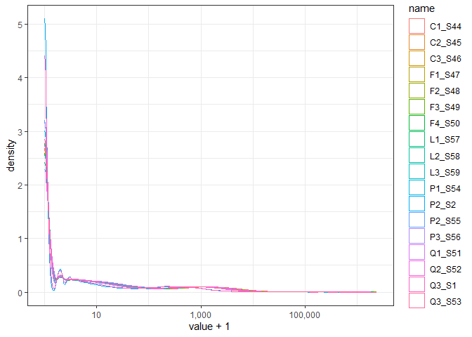<!-- -->

``` r
temp <- count_df %>%
  pivot_longer(!gene_id) %>%
  mutate(condition = str_replace(string = name, 
                                 pattern = "\\d_S\\d+", 
                                 replacement = "")) %>%
  mutate(condition = case_when(
    condition == "C" ~ "blue",
    condition == "F" ~ "red",
    condition == "L" ~ "darkgreen",
    condition == "P" ~ "purple",
    condition == "Q" ~ "pink"))


temp %>%
  ggplot(aes(x=value + 1, color= name))+
  geom_density() +
  scale_x_continuous(trans = 'log10', labels = scales::comma) +
  scale_color_manual(values = temp$condition, 
                     breaks = temp$name) 
```

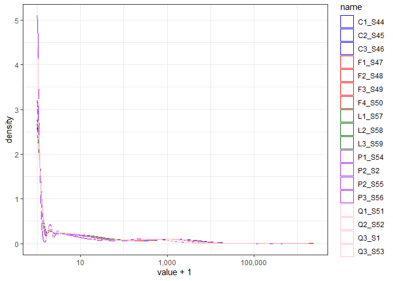<!-- -->

``` r
temp %>%
  filter(value > 0) %>%
  ggplot(aes(x=value, color= name))+
  geom_density() +
  scale_x_continuous(trans = 'log10', labels = scales::comma) +
  scale_color_manual(values = temp$condition, 
                     breaks = temp$name) 
```

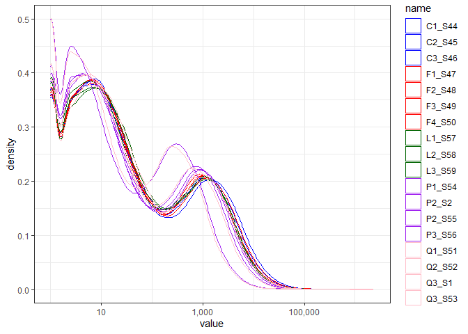<!-- -->

We can observe that one sample from the P group and onse sample from the
Q group are slightly shifted to the left in comparison to other samples.
It is possible that these samples correspond to the two samples in a
different folder from the sequencing portal.

TODO: Check sample names from the different folder.

## Analyze RNA biotypes

Given the nature of the ribodepleted sequencing, it is possible to
capture RNA molecules other than mRNA. We will first explore the
composition of these biotypes in the overall dataset.

``` r
biotype_file <- file.path(data_path, "biotypes" ,"biotype_table.tsv")

if(!file.exists(biotype_file)){
  # 1. Connect to the Ensembl mart
  ensembl <- useEnsembl(
    biomart    = "genes",
    dataset    = "hsapiens_gene_ensembl",
    version    = NULL  # latest; TODO: check what version corresponds to our GTF
  )
  
  # 2. Query for gene_biotype
  genes <- count_df$gene_id %>% unique()
  bm <- getBM(
    attributes = c("ensembl_gene_id", "gene_biotype"),
    filters    = "ensembl_gene_id",
    values     = genes,
    mart       = ensembl
  )
  
  # 3. Save output in case biomaRt doesn't cooperate in the future
  write_tsv(bm, biotype_file)
}

biotype_table <- read.table(biotype_file, header = TRUE)
```

``` r
biotype_table %>% 
  # 1) reorder gene_biotype by descending frequency
  mutate(gene_biotype = fct_infreq(gene_biotype)) %>%  
  # 2) plot
  ggplot(aes(x = gene_biotype)) +
    geom_bar(fill = 'lightblue') +
    # 3) add labels, one per bar, vertically centered
    geom_text(
      stat = 'count', 
      aes(label = after_stat(count)), 
      position = position_stack(vjust = 0.5),
      color = 'black', size = 3
    ) +
    coord_flip() +
    labs(
      x = 'Gene biotype',
      y = 'Number of ENSEMBL IDs',
      title = 'Counts per gene biotype'
    ) 
```

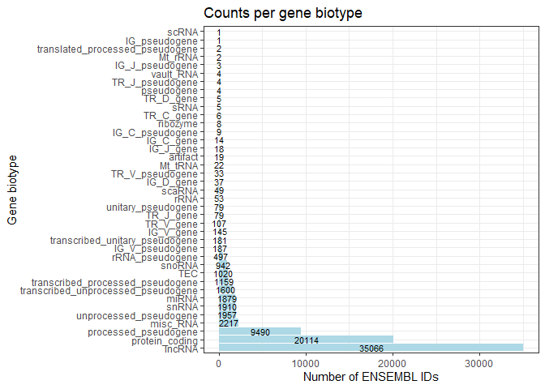<!-- -->

Based on this graph we can identify that a large number of the entries
in the expression table come from non-coding mRNAs. To facilitate future
re-usability of the data, we will generate different expression tables
based on the ENSEMBL biotype.

``` r
biotypes <- c("protein_coding", "lncRNA", "snRNA", "miRNA", "snoRNA")
for(current in biotypes){
  temp <- biotype_table %>%
    filter(gene_biotype == current) %>%
    dplyr::select(ensembl_gene_id)  
  current_file <- file.path(data_path, "biotypes", paste(current, "exp.tsv", sep = "_"))
  if(!file.exists(current_file)){
    count_df %>%
      filter(gene_id %in% temp$ensembl_gene_id) %>%
      write_tsv(current_file)  
  }
}

# Save CPMs for all biotypes

biotypes <- c("protein_coding", "lncRNA", "snRNA", "miRNA", "snoRNA")
cpm_data <- count_df %>%
  dplyr::select(!gene_id) %>%
  cpm(log = TRUE, prior.count = 2)
cpm_data <- data.table(gene_id = count_df$gene_id, cpm_data)
for(current in biotypes){
  temp <- biotype_table %>%
    filter(gene_biotype == current) %>%
    dplyr::select(ensembl_gene_id)  
  current_file <- file.path(data_path, "biotypes", paste(current, "log2cpm.tsv", sep = "_"))
  if(!file.exists(current_file)){
    cpm_data %>%
      filter(gene_id %in% temp$ensembl_gene_id) %>%
      write_tsv(current_file)  
  }
}
```

# Exploratory Analysis on Protein Coding Genes

## Count distribution

``` r
# Read count table
count_df <- read.table(file.path(data_path, "biotypes", "protein_coding_exp.tsv"), 
                       header = TRUE) 

count_df %>%
  head()
```

    ##           gene_id C1_S44 C2_S45 C3_S46 F1_S47 F2_S48 F3_S49 F4_S50 L1_S57
    ## 1 ENSG00000142655   1258   1010    935    791    989    864    869    911
    ## 2 ENSG00000149527     47     43     43     31     45     22     36    201
    ## 3 ENSG00000171621    793    628    556    471    610    517    513   1370
    ## 4 ENSG00000142583      0      1      0      1      5      1      0      0
    ## 5 ENSG00000173614    300    236    229    166    204    199    213    339
    ## 6 ENSG00000204624      6      6      8      7     10      3      9     12
    ##   L2_S58 L3_S59 P1_S54 P2_S2 P2_S55 P3_S56 Q1_S51 Q2_S52 Q3_S1 Q3_S53
    ## 1    866    930    759   251    573    667    745    631   197    552
    ## 2    142    163     34    16     27     35     46     24     6     18
    ## 3   1240   1256    628   180    514    584    786    769   207    527
    ## 4      0      0      0     0      0      0      2      2     0      0
    ## 5    284    269    147    61    115    168    264    282    78    166
    ## 6      3      6      6     0      7      5     22      3     4      5

By looking at the density plots of the expression data it is possible to
determine if any sample is a clear outlier.

``` r
count_df %>%
  pivot_longer(!gene_id) %>%
  ggplot(aes(x=value + 1, color = name)) +
    geom_density() +
    scale_x_continuous(trans = 'log10', labels = scales::comma)
```

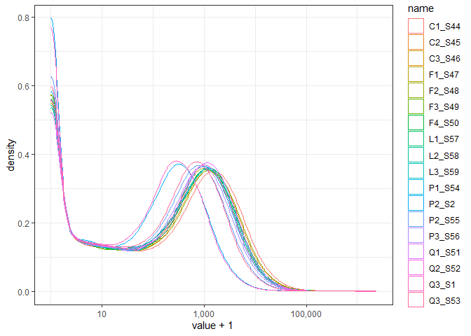<!-- -->

``` r
temp <- count_df %>%
  pivot_longer(!gene_id) %>%
  mutate(condition = str_replace(string = name, 
                                 pattern = "\\d_S\\d+", 
                                 replacement = "")) %>%
  mutate(condition = case_when(
    condition == "C" ~ "blue",
    condition == "F" ~ "red",
    condition == "L" ~ "darkgreen",
    condition == "P" ~ "purple",
    condition == "Q" ~ "pink"))


temp %>%
  ggplot(aes(x=value + 1, color= name))+
  geom_density() +
  scale_x_continuous(trans = 'log10', labels = scales::comma) +
  scale_color_manual(values = temp$condition, 
                     breaks = temp$name) 
```

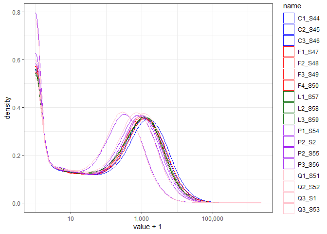<!-- -->

``` r
temp %>%
  filter(value > 0) %>%
  ggplot(aes(x=value, color= name))+
  geom_density() +
  scale_x_continuous(trans = 'log10', labels = scales::comma) +
  scale_color_manual(values = temp$condition, 
                     breaks = temp$name) 
```

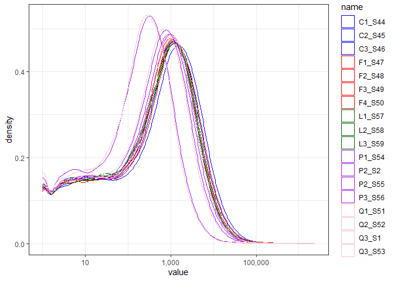<!-- -->

We can observe the same trend for the P and Q samples that are shifted
to the left.

## Filter lowly expressed genes

To increase data quality we removed lowly expressed genes in two steps:

1.  Removed genes with no counts across all samples.

``` r
# Remove columns with gene information 
exp_mat <- count_df %>%
  column_to_rownames("gene_id")
# Remove rows with all entries equal zero
exp_mat <- exp_mat[!(rowSums(exp_mat == 0) == ncol(exp_mat)),]
apply(exp_mat, MARGIN = 2, quantile)
```

    ##         C1_S44  C2_S45  C3_S46  F1_S47  F2_S48    F3_S49    F4_S50    L1_S57
    ## 0%         0.0       0       0       0       0       0.0       0.0       0.0
    ## 25%        8.0       7       7       7       7       6.0       7.0       9.0
    ## 50%      391.0     330     307     289     348     304.0     312.0     316.0
    ## 75%     1928.5    1599    1454    1343    1668    1446.5    1471.5    1503.5
    ## 100% 2349679.0 1998806 1760118 1583897 2041784 1815816.0 1853778.0 1287207.0
    ##         L2_S58    L3_S59  P1_S54  P2_S2    P2_S55  P3_S56    Q1_S51    Q2_S52
    ## 0%         0.0       0.0       0      0       0.0       0       0.0       0.0
    ## 25%        7.0       8.5       6      2       5.0       5      11.0       8.0
    ## 50%      278.0     297.0     273     87     214.0     245     352.0     297.0
    ## 75%     1370.5    1433.5    1271    402     985.5    1160    1508.5    1324.5
    ## 100% 1175376.0 1215087.0 1336737 414030 1010108.0 1282434 1591811.0 1374942.0
    ##       Q3_S1   Q3_S53
    ## 0%        0      0.0
    ## 25%       3      6.0
    ## 50%      92    219.0
    ## 75%     394    938.5
    ## 100% 399879 959783.0

Based on this quick summary, seems like the problematic samples are P2
and Q3.

2.  Removed genes with less than two reads in more than 12 samples.

``` r
# We use the average 1st quartile as threshold (6.64), round down to 6
# floor(mean(apply(exp_mat, MARGIN = 2, quantile, 0.25)))
# Select genes to keep
min_reads <- 6
min_samples <- 10
genes_to_keep <- apply(exp_mat >= min_reads, 
                       MARGIN = 1, sum) >= min_samples

# Final gene count matrix
exp_mat <- exp_mat[genes_to_keep,]
```

Now we repeat the previous visualizations to explore how the count
distributions changed after filtering

``` r
exp_mat %>%
  rownames_to_column("gene_id") %>%
  pivot_longer(!gene_id) %>%
  ggplot(aes(x=value + 1, color = name)) +
    geom_density() +
    scale_x_continuous(trans = 'log10', labels = scales::comma)
```

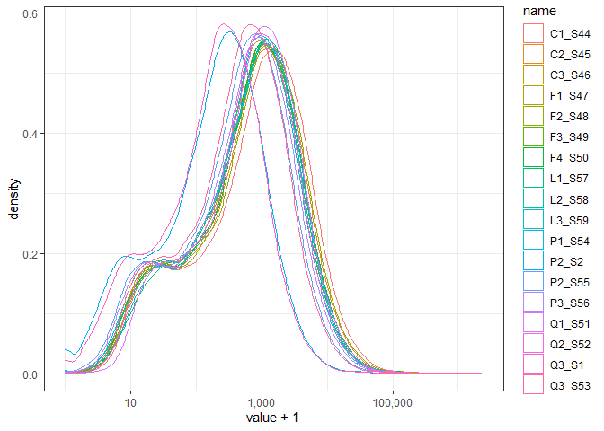<!-- -->

``` r
temp <- exp_mat %>%
  rownames_to_column("gene_id") %>%
  pivot_longer(!gene_id) %>%
  mutate(condition = str_replace(string = name, 
                                 pattern = "\\d_S\\d+", 
                                 replacement = "")) %>%
  mutate(condition = case_when(
    condition == "C" ~ "blue",
    condition == "F" ~ "red",
    condition == "L" ~ "darkgreen",
    condition == "P" ~ "purple",
    condition == "Q" ~ "pink"))


temp %>%
  ggplot(aes(x=value + 1, color= name))+
  geom_density() +
  scale_x_continuous(trans = 'log10', labels = scales::comma) +
  scale_color_manual(values = temp$condition, 
                     breaks = temp$name) 
```

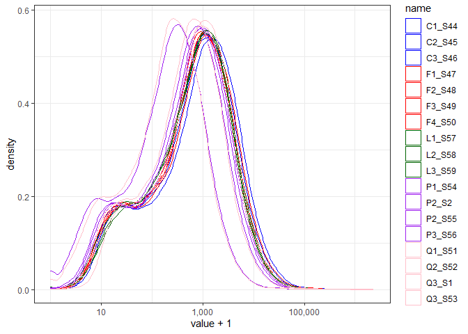<!-- -->

This step made samples distributions to look mostly normal on the log10
scale.

## CPM normalization

Before proceeding to further analysis we need to normalize the gene
counts, we will use *counts per million* (CPM) to adjust for library
size and transform it to log space for better visualization.

``` r
# CPM normalization and transform to log2
expr_log2cpm <- cpm(exp_mat, 
                    log = TRUE, 
                    prior.count = 1) %>% 
  data.frame() 

expr_log2cpm %>%
  rownames_to_column(var = "gene_id") %>%
  pivot_longer(!gene_id) %>%
  ggplot(aes(x=value, color= name))+
  geom_density() 
```

<!-- -->

Samples normalized by library size seem to remove the artifact for
samples P and Q

### Violin plots

To directly compare sample gene expression distribution without overlap
between density plots we generated the respective violin plots

``` r
temp <- expr_log2cpm %>%
  rownames_to_column(var="gene_id") %>%
  pivot_longer(!gene_id) %>%
  mutate(condition = str_replace(string = name, 
                                 pattern = "\\d_S\\d+", 
                                 replacement = "")) 
# Convert condition to factor 
temp <- temp %>%
  mutate(condition = factor(condition, 
                            levels =c("C","F","L","P","Q")))

# Plot using ggplot with correct fill mapping
temp %>%
  ggplot(aes(x=name, y=value, fill = condition)) +
  geom_violin()+
  scale_fill_manual(values = c("C" = "blue", 
                               "F" = "red", 
                               "L" = "darkgreen", 
                               "P" = "purple",
                               "Q" = "pink")) +
  theme(axis.text.x = element_text(angle = 45, hjust=1))
```

<!-- -->

Utilizing log2(CPM) values we can observe that all samples have similar
expression distributions.

### Sample-sample correlation plot

Using normalized counts we generated a plot to observe if there is
correlation within experimental groups such that samples are clustered
accordingly.

``` r
# Annotation

# Standardize conditon names
condition <- names(expr_log2cpm) %>% 
  str_replace(pattern = "\\d_S\\d+", 
              replacement = "")

annot <- data.frame(Diet = as.factor(condition),
                    row.names = names(expr_log2cpm))

annot_colors <- list(Diet = c("C" = "blue", 
                              "F" = "red", 
                              "L" = "darkgreen", 
                              "P" = "purple",
                              "Q" = "pink"))

# Heatmap            
expr_log2cpm %>%
  cor(method = "spearman") %>%
  pheatmap(annotation_col = annot,
           annotation_row = annot,
           show_rownames = FALSE, 
           annotation_colors = annot_colors, 
           angle_col = 45)
```

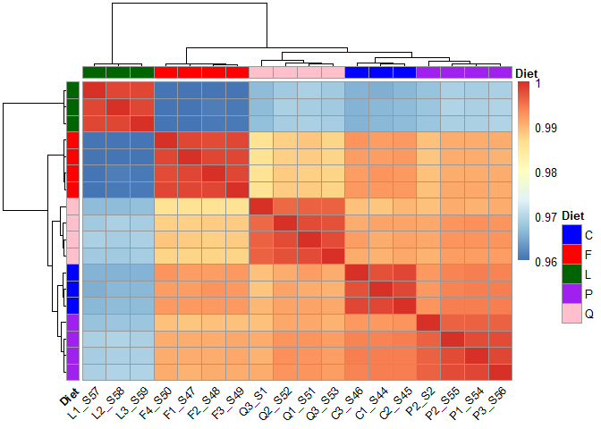<!-- -->

### Principal Component Analysis (PCA)

Another way of determining relationship between the samples is through a
PCA analysis, which reduces the dimentionality of our data to a set of
independent variables (principal components) that represent the major
proportion of variability in our data.

``` r
PCs <- prcomp(t(cpm(exp_mat)), center = TRUE, scale = TRUE)
# Scree plot 
fviz_eig(PCs)
```

<!-- -->

``` r
# Scatter plot
eig_val <- get_eigenvalue(PCs)
PCs <- cbind(annot, PCs$x[,1:10])
PCs$sample_id <- rownames(PCs)

PCs <- PCs %>%
  mutate(color_class = case_when(
    condition == "C" ~ "blue",
    condition == "F" ~ "red",
    condition == "L" ~ "darkgreen",
    condition == "P" ~ "purple",
    condition == "Q" ~ "orange")) 

PCs %>%
  ggplot(aes(x = PC1, y = PC2, 
             color = condition)) + 
  geom_point(aes(size = 8)) + 
  scale_color_manual(values = PCs$color_class, 
                     breaks = PCs$Diet) +
  labs(x= paste("PC1 (",round(eig_val$variance.percent[1], 2),"%)", sep = ""),
       y= paste("PC2 (",round(eig_val$variance.percent[2], 2),"%)", sep = ""))+
  guides(size = "none") +
  theme_bw()
```

<!-- -->

``` r
PCs %>%
  ggplot(aes(x = PC3, y = PC2, 
             color = Diet)) + 
  geom_point(aes(size = 8)) + 
  scale_color_manual(values = PCs$color_class, 
                     breaks = PCs$Diet) +
  labs(x= paste("PC3 (",round(eig_val$variance.percent[3], 2),"%)", sep = ""),
       y= paste("PC2 (",round(eig_val$variance.percent[2], 2),"%)", sep = ""))+
  guides(size = "none") +
  theme_bw()
```

<!-- -->

# Exploratory Analysis on lncRNA

## Count distribution

``` r
# Read count table
count_df <- read.table(file.path(data_path, "biotypes", "lncRNA_log2cpm.tsv"), 
                       header = TRUE) 

count_df %>%
  head()
```

    ##           gene_id    C1_S44    C2_S45     C3_S46    F1_S47    F2_S48     F3_S49
    ## 1 ENSG00000232596 -3.870547 -3.870547 -3.8705473 -3.870547 -3.870547 -3.8705473
    ## 2 ENSG00000231510 -3.870547 -3.870547 -3.8705473 -3.870547 -3.870547 -3.8705473
    ## 3 ENSG00000272235 -1.778432 -1.679801 -0.4612835 -0.857900 -1.054788 -0.8682519
    ## 4 ENSG00000284694 -3.870547 -3.870547 -3.8705473 -3.870547 -3.870547 -3.8705473
    ## 5 ENSG00000224387 -3.870547 -3.870547 -3.8705473 -3.870547 -3.870547 -3.8705473
    ## 6 ENSG00000284674 -3.870547 -3.870547 -3.8705473 -3.870547 -3.870547 -3.8705473
    ##      F4_S50    L1_S57     L2_S58     L3_S59    P1_S54     P2_S2    P2_S55
    ## 1 -3.870547 -3.870547 -3.8705473 -3.8705473 -3.870547 -3.870547 -3.870547
    ## 2 -3.870547 -3.870547 -3.8705473 -3.8705473 -3.870547 -3.870547 -3.870547
    ## 3 -1.350113 -2.195081 -0.7385685 -0.3400815 -1.369952 -1.782772 -1.059396
    ## 4 -3.870547 -3.870547 -3.8705473 -3.8705473 -3.870547 -3.870547 -3.870547
    ## 5 -3.870547 -2.658578 -3.8705473 -3.8705473 -3.870547 -3.870547 -3.870547
    ## 6 -3.870547 -3.870547 -3.8705473 -3.8705473 -3.870547 -3.870547 -3.870547
    ##      P3_S56    Q1_S51    Q2_S52      Q3_S1    Q3_S53
    ## 1 -3.870547 -3.870547 -3.870547 -3.8705473 -3.870547
    ## 2 -3.870547 -3.870547 -3.870547 -3.8705473 -3.870547
    ## 3 -1.404821 -1.251261 -1.312456 -0.2158923 -1.014380
    ## 4 -3.870547 -3.870547 -3.870547 -3.8705473 -3.870547
    ## 5 -3.870547 -3.870547 -2.886610 -3.8705473 -3.110597
    ## 6 -3.870547 -3.870547 -3.870547 -3.8705473 -3.870547

By looking at the density plots of the expression data it is possible to
determine if any sample is a clear outlier.

``` r
count_df %>%
  pivot_longer(!gene_id) %>%
  ggplot(aes(x=value, color = name)) +
    geom_density() +
    scale_x_continuous(trans = 'log2', labels = scales::comma)
```

    ## Warning in transformation$transform(x): Se han producido NaNs

    ## Warning in scale_x_continuous(trans = "log2", labels = scales::comma): log-2
    ## transformation introduced infinite values.

    ## Warning: Removed 574981 rows containing non-finite outside the scale range
    ## (`stat_density()`).

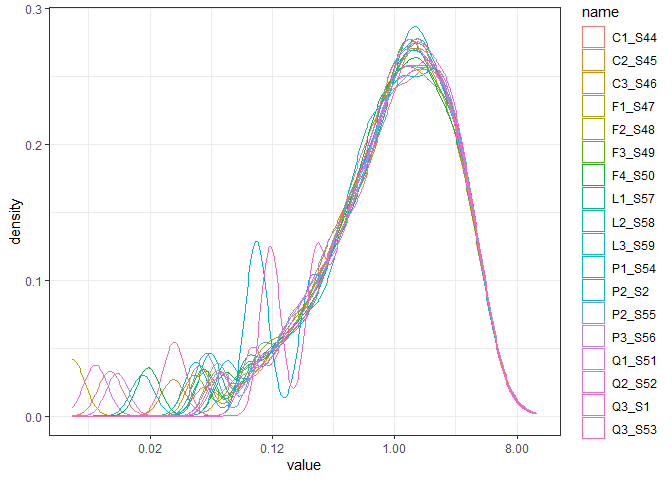<!-- -->

``` r
temp <- count_df %>%
  pivot_longer(!gene_id) %>%
  mutate(condition = str_replace(string = name, 
                                 pattern = "\\d_S\\d+", 
                                 replacement = "")) %>%
  mutate(condition = case_when(
    condition == "C" ~ "blue",
    condition == "F" ~ "red",
    condition == "L" ~ "darkgreen",
    condition == "P" ~ "purple",
    condition == "Q" ~ "pink"))


temp %>%
  ggplot(aes(x=value, color= name))+
  geom_density() +
  scale_color_manual(values = temp$condition, 
                     breaks = temp$name)+
  scale_x_continuous(trans = 'log2', labels = scales::comma) 
```

    ## Warning in transformation$transform(x): Se han producido NaNs

    ## Warning in scale_x_continuous(trans = "log2", labels = scales::comma): log-2
    ## transformation introduced infinite values.

    ## Warning: Removed 574981 rows containing non-finite outside the scale range
    ## (`stat_density()`).

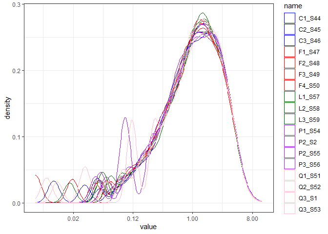<!-- -->

``` r
temp %>%
  filter(value > 0) %>%
  ggplot(aes(x=value, color= name))+
  geom_density() +
  scale_color_manual(values = temp$condition, 
                     breaks = temp$name) +
  scale_x_continuous(trans = 'log2', labels = scales::comma)
```

<!-- -->

We can observe the same trend for the P and Q samples that are shifted
to the left.

## Filter lowly expressed lncRNA

To increase data quality we removed lowly expressed lncRNA in two steps:

1.  Removed lncRNA with no counts across all samples.

``` r
# Remove columns with gene information 
exp_mat <- count_df %>%
  column_to_rownames("gene_id")
# Remove rows with all entries equal zero
exp_mat <- exp_mat[!(rowSums(exp_mat == 0) == ncol(exp_mat)),]
```

Now we repeat the previous visualizations to explore how the count
distributions changed after filtering

``` r
exp_mat %>%
  rownames_to_column("lncRNA") %>%
  pivot_longer(!lncRNA) %>%
  ggplot(aes(x=value, color = name)) +
    geom_density() +
    scale_x_continuous(trans = 'log2', labels = scales::comma)
```

<!-- -->

This step made samples distributions to look mostly normal on the log2
scale.

## Violin plots

To directly compare sample gene expression distribution without overlap
between density plots we generated the respective violin plots

``` r
temp <- exp_mat %>%
  rownames_to_column(var="lncRNA") %>%
  pivot_longer(!lncRNA) %>%
  mutate(condition = str_replace(string = name, 
                                 pattern = "\\d_S\\d+", 
                                 replacement = "")) 
# Convert condition to factor 
temp <- temp %>%
  mutate(condition = factor(condition, 
                            levels =c("C","F","L","P","Q")))

# Plot using ggplot with correct fill mapping
temp %>%
  ggplot(aes(x=name, y=value + 4, fill = condition)) +
  geom_violin()+
  scale_fill_manual(values = c("C" = "blue", 
                               "F" = "red", 
                               "L" = "darkgreen", 
                               "P" = "purple",
                               "Q" = "pink")) +
  theme(axis.text.x = element_text(angle = 45, hjust=1))+
  scale_y_continuous(trans = 'log2', labels = scales::comma)
```

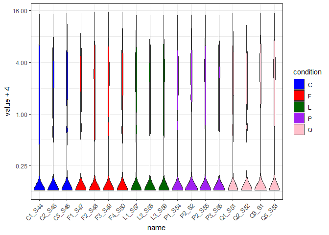<!-- -->

## Sample-sample correlation plot

Using normalized counts we generated a plot to observe if there is
correlation within experimental groups such that samples are clustered
accordingly.

``` r
# Annotation

# Standardize conditon names
condition <- names(exp_mat) %>% 
  str_replace(pattern = "\\d_S\\d+", 
              replacement = "")

annot <- data.frame(Diet = as.factor(condition),
                    row.names = names(exp_mat))

annot_colors <- list(Diet = c("C" = "blue", 
                              "F" = "red", 
                              "L" = "darkgreen", 
                              "P" = "purple",
                              "Q" = "pink"))

# Heatmap            
exp_mat %>%
  cor(method = "spearman") %>%
  pheatmap(annotation_col = annot,
           annotation_row = annot,
           show_rownames = FALSE, 
           annotation_colors = annot_colors, 
           angle_col = 45)
```

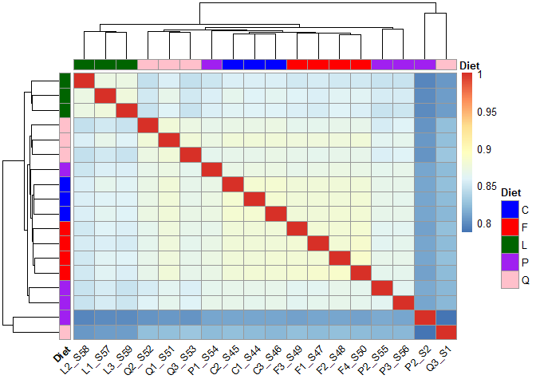<!-- -->

# Exploratory Analysis on miRNA

## Count distribution

``` r
# Read count table
count_df <- read.table(file.path(data_path, "biotypes", "miRNA_log2cpm.tsv"), 
                       header = TRUE) 

count_df %>%
  head()
```

    ##           gene_id    C1_S44    C2_S45    C3_S46    F1_S47    F2_S48    F3_S49
    ## 1 ENSG00000264341 -3.870547 -3.870547 -3.870547 -3.870547 -3.870547 -3.870547
    ## 2 ENSG00000264101 -3.870547 -3.389086 -3.347028 -3.870547 -3.870547 -3.870547
    ## 3 ENSG00000284357 -3.870547 -3.870547 -3.870547 -3.870547 -3.870547 -3.870547
    ## 4 ENSG00000207941 -3.870547 -3.870547 -3.870547 -3.870547 -3.870547 -3.870547
    ## 5 ENSG00000264698 -3.870547 -3.870547 -3.870547 -3.870547 -3.870547 -3.870547
    ## 6 ENSG00000283724 -3.870547 -3.870547 -3.870547 -3.870547 -3.870547 -3.870547
    ##      F4_S50    L1_S57    L2_S58    L3_S59    P1_S54     P2_S2    P2_S55
    ## 1 -3.870547 -3.870547 -3.870547 -3.870547 -3.870547 -3.870547 -3.870547
    ## 2 -3.353840 -3.870547 -3.299698 -3.870547 -3.870547 -3.870547 -3.870547
    ## 3 -3.870547 -3.870547 -3.870547 -3.870547 -3.870547 -3.870547 -3.870547
    ## 4 -2.974181 -3.870547 -3.870547 -3.870547 -3.870547 -3.870547 -3.870547
    ## 5 -3.870547 -3.870547 -3.870547 -3.870547 -3.870547 -3.870547 -3.870547
    ## 6 -3.870547 -3.870547 -3.870547 -3.870547 -3.870547 -3.870547 -3.870547
    ##      P3_S56    Q1_S51    Q2_S52     Q3_S1    Q3_S53
    ## 1 -3.870547 -3.870547 -3.870547 -3.870547 -3.870547
    ## 2 -3.870547 -3.870547 -3.870547 -3.870547 -3.870547
    ## 3 -3.870547 -3.870547 -3.870547 -3.870547 -3.870547
    ## 4 -3.870547 -3.870547 -3.870547 -3.870547 -3.110597
    ## 5 -3.870547 -3.870547 -3.870547 -3.870547 -3.870547
    ## 6 -3.870547 -3.870547 -3.870547 -3.870547 -3.870547

By looking at the density plots of the expression data it is possible to
determine if any sample is a clear outlier.

``` r
count_df %>%
  pivot_longer(!gene_id) %>%
  ggplot(aes(x=value+4, color = name)) +
    geom_density() +
    scale_x_continuous(trans = 'log2', labels = scales::comma)
```

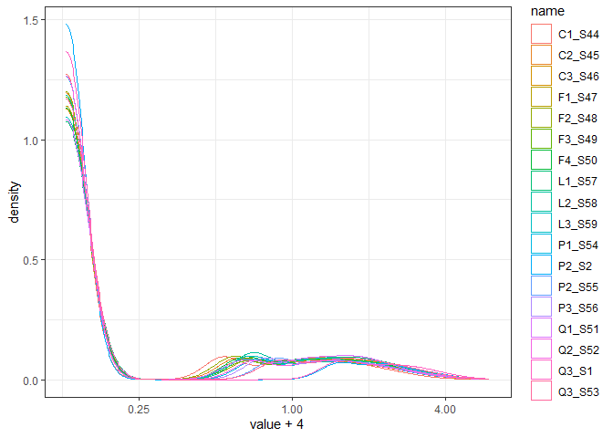<!-- -->

``` r
temp <- count_df %>%
  pivot_longer(!gene_id) %>%
  mutate(condition = str_replace(string = name, 
                                 pattern = "\\d_S\\d+", 
                                 replacement = "")) %>%
  mutate(condition = case_when(
    condition == "C" ~ "blue",
    condition == "F" ~ "red",
    condition == "L" ~ "darkgreen",
    condition == "P" ~ "purple",
    condition == "Q" ~ "pink"))


temp %>%
  ggplot(aes(x=value+4, color= name))+
  geom_density() +
  scale_color_manual(values = temp$condition, 
                     breaks = temp$name)+
  scale_x_continuous(trans = 'log2', labels = scales::comma) 
```

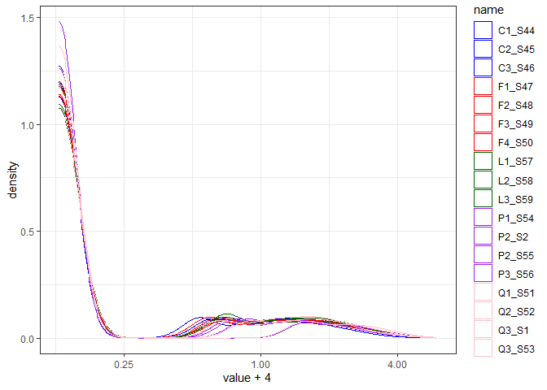<!-- -->

``` r
temp %>%
  filter(value > 0) %>%
  ggplot(aes(x=value, color= name))+
  geom_density() +
  scale_color_manual(values = temp$condition, 
                     breaks = temp$name) +
  scale_x_continuous(trans = 'log2', labels = scales::comma)
```

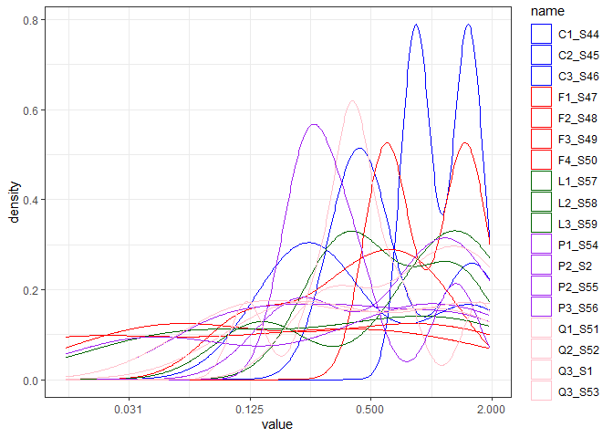<!-- -->

We can observe the same trend for the P and Q samples that are shifted
to the left.

## Filter lowly expressed lncRNA

To increase data quality we removed lowly expressed lncRNA in two steps:

1.  Removed lncRNA with no counts across all samples.

``` r
# Remove columns with gene information 
exp_mat <- count_df %>%
  column_to_rownames("gene_id")
# Remove rows with all entries equal zero
exp_mat <- exp_mat[!(rowSums(exp_mat == 0) == ncol(exp_mat)),]
```

Now we repeat the previous visualizations to explore how the count
distributions changed after filtering

``` r
exp_mat %>%
  rownames_to_column("miRNA") %>%
  pivot_longer(!miRNA) %>%
  ggplot(aes(x=value, color = name)) +
    geom_density() +
    scale_x_continuous(trans = 'log2', labels = scales::comma)
```

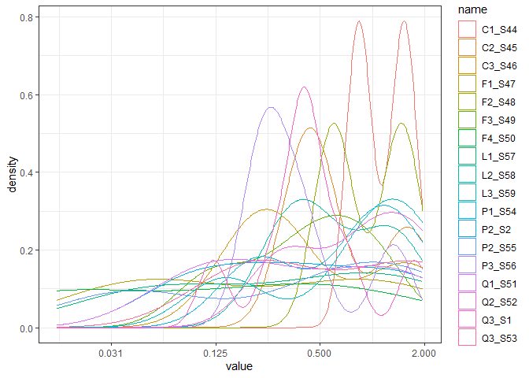<!-- -->

This step made samples distributions to look mostly normal on the log2
scale.

## Violin plots

To directly compare sample gene expression distribution without overlap
between density plots we generated the respective violin plots

``` r
temp <- exp_mat %>%
  rownames_to_column(var="miRNA") %>%
  pivot_longer(!miRNA) %>%
  mutate(condition = str_replace(string = name, 
                                 pattern = "\\d_S\\d+", 
                                 replacement = "")) 
# Convert condition to factor 
temp <- temp %>%
  mutate(condition = factor(condition, 
                            levels =c("C","F","L","P","Q")))

# Plot using ggplot with correct fill mapping
temp %>%
  ggplot(aes(x=name, y=value + 4, fill = condition)) +
  geom_violin()+
  scale_fill_manual(values = c("C" = "blue", 
                               "F" = "red", 
                               "L" = "darkgreen", 
                               "P" = "purple",
                               "Q" = "pink")) +
  theme(axis.text.x = element_text(angle = 45, hjust=1))+
  scale_y_continuous(trans = 'log2', labels = scales::comma)
```

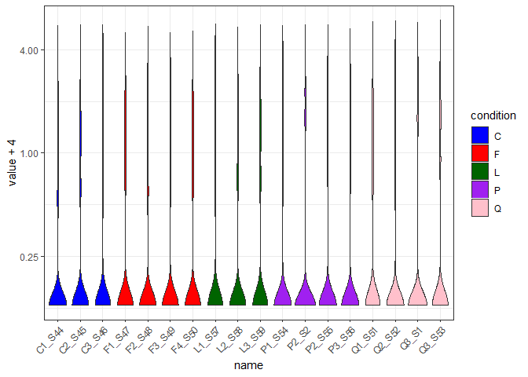<!-- -->

### Sample-sample correlation plot

Using normalized counts we generated a plot to observe if there is
correlation within experimental groups such that samples are clustered
accordingly.

``` r
# Annotation

# Standardize conditon names
condition <- names(exp_mat) %>% 
  str_replace(pattern = "\\d_S\\d+", 
              replacement = "")

annot <- data.frame(Diet = as.factor(condition),
                    row.names = names(exp_mat))

annot_colors <- list(Diet = c("C" = "blue", 
                              "F" = "red", 
                              "L" = "darkgreen", 
                              "P" = "purple",
                              "Q" = "pink"))

# Heatmap            
exp_mat %>%
  cor(method = "spearman") %>%
  pheatmap(annotation_col = annot,
           annotation_row = annot,
           show_rownames = FALSE, 
           annotation_colors = annot_colors, 
           angle_col = 45)
```

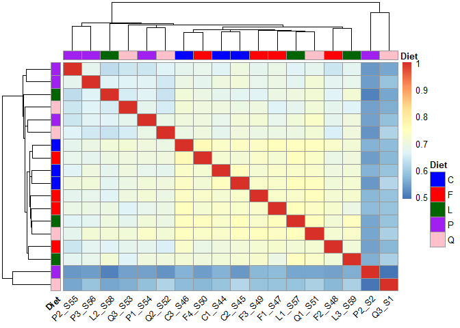<!-- -->
